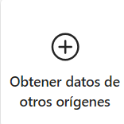
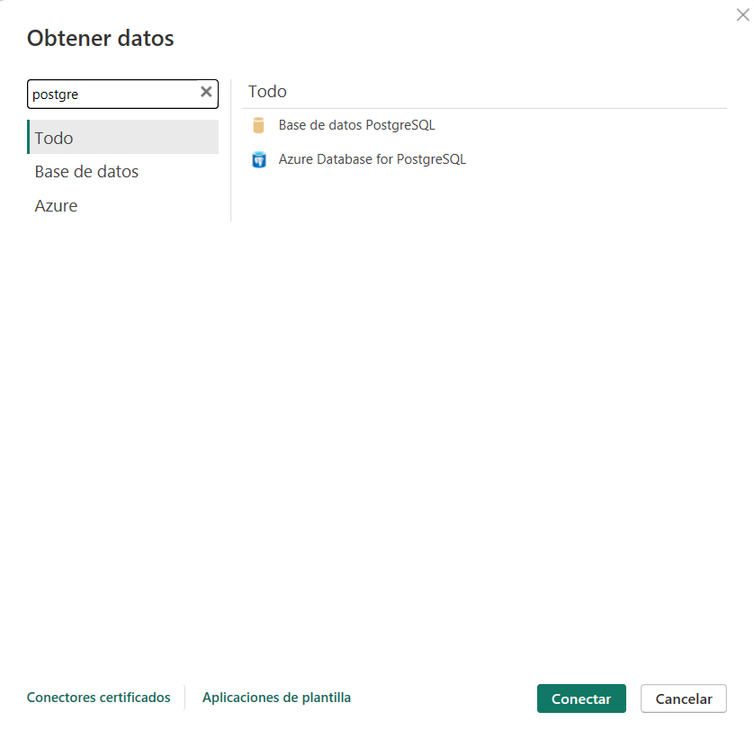
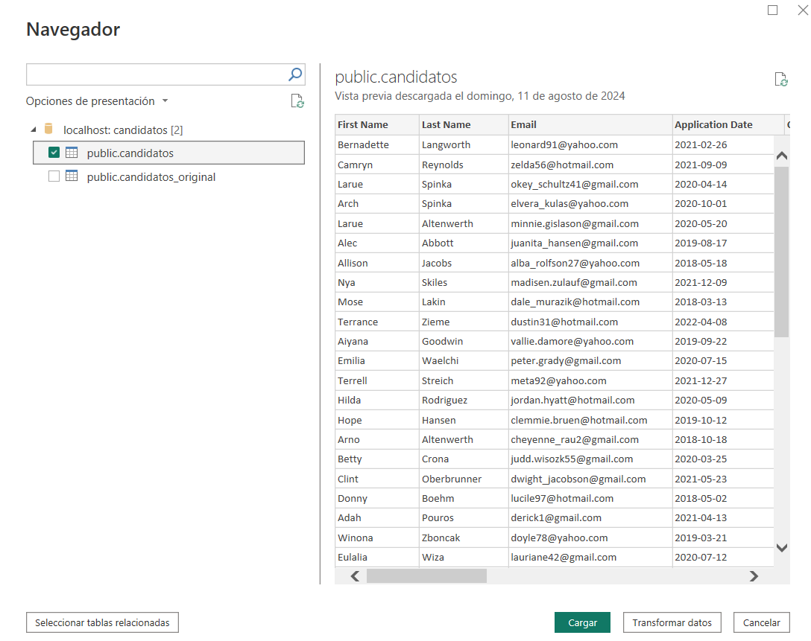

# WORKSHOP 01 by David Melo Valbuena

Presented by **David Melo Valbuena**

## Welcome

This project involves receiving a CSV file with data from candidates. The main objective was to perform an analysis and manipulation of the data to extract relevant information and finally create data visualizations.

### Tools used

-  Python
-  Jupyter Notebooks
-  PostgreSQL
-  Power BI
-  SQLAlchemy

### Requirements

1. Install Python: [Python Downloads](https://www.python.org/downloads/)
2. Install PostgreSQL: [PostgreSQL Downloads](https://www.postgresql.org/download/)
3. Install Power BI: [Install Power BI Desktop](https://powerbi.microsoft.com/en-us/desktop/)

### About the data

This dataset has 50k rows of data about candidates. The column names and their respective data types before data transformation are:

- **First Name**: Object
- **Last Name**: Object
- **Email**: Object
- **Application Date**: Object
- **Country**: Object
- **YOE (Years of Experience)**: Integer
- **Seniority**: Object
- **Technology**: Object
- **Code Challenge Score**: Integer
- **Technical Interview Score**: Integer


## Repository Organization

- **data**: This folder contains the CSV file `candidates (1).csv` used as the source data for the analysis.
- **db_operations**: This folder includes the notebook responsible for interacting with the PostgreSQL database, performing data insertion, and extraction operations from the `candidates_original` table.
- **notebooks**: This folder contains all the exploratory data analysis (EDA) notebooks. Notably, it includes `CandidatesPostgressEDA.ipynb`, which performs data exploration on data extracted from the PostgreSQL database.
- **SRC**: This folder holds supporting code and resources like the `Dashboard_WorkShop1.pdf` and the requirements file for installing necessary dependencies.

## Setup Instructions

1. Clone the project:

    ```bash
    git clone https://github.com/Davidmelo9133/WorkShop1_ETL.git
    ```

2. Go to the project directory:

    ```bash
    cd WorkShop1_ETL
    ```

3. Create a virtual environment for Python:

    ```bash
    python -m venv venv
    ```

4. Install libraries:

    ```bash
    pip install -r requirements.txt
    ```

5. Create a database in PostgreSQL.

6. Explore the project, you should start by folder **db_operations**:

    - **database_setup**: this notebook focuses on database connection, table creation, and data insertion.
    - **transform_data**: provides methods for processing and transforming data from a CSV file.

7. Continue executing folder **notebooks**:

    - **eda**: In this notebook, we will dive into a comprehensive exploration of the dataset.
8. Open Power BI and select the **PostgreSQL** option:

    

9. Search and select **PostgreSQL** as the data source:

    

10. Enter your PostgreSQL server credentials:

    

11. Select the **candidatos** table (since **candidatos_original** is a raw dataset):

    
